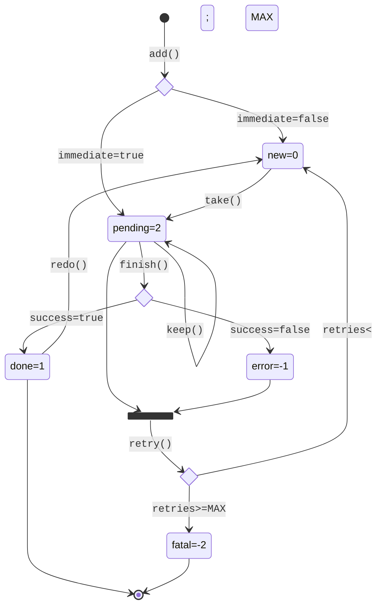

```mermaid
stateDiagram-v2

%% state base {
  task_new: new=0
  task_pending: pending=2
  task_done: done=1
%% }

task_error: error=-1
task_fatal: fatal=-2

state add <<choice>>
[*] --> add: <code>add()</code>
add --> task_new: <code>immediate=false</code>
add --> task_pending: <code>immediate=true</code>
task_new --> task_pending: <code>take()</code>

state success <<choice>> 

task_pending --> task_pending: <code>keep()</code>

task_pending --> success: <code>finish()</code>
success --> task_done: <code>success=true</code>
success --> task_error: <code>success=false</code>

task_done --> [*]
task_fatal --> [*]

state retrying <<join>>
state retry <<choice>>

task_pending --> retrying
task_error --> retrying
retrying --> retry: <code>retry()</code>
retry --> task_new: <code>retries&lt; MAX</code>
retry --> task_fatal: <code>retries>=MAX</code>

task_done --> task_new: <code>redo()</code>

%% task_pending --> task_new
```
